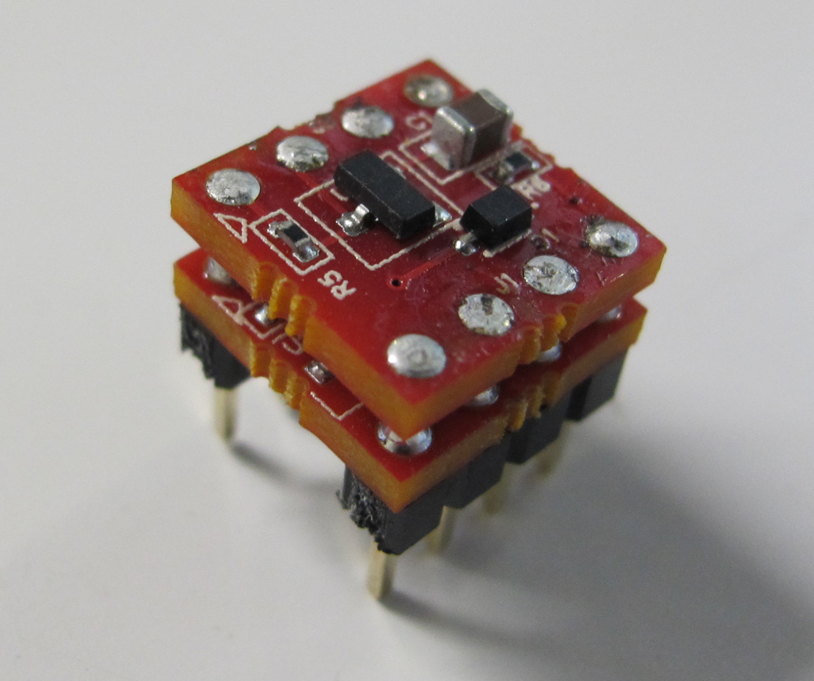
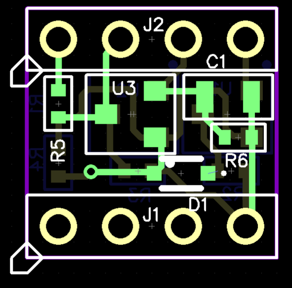
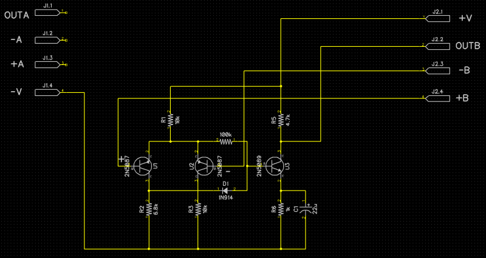
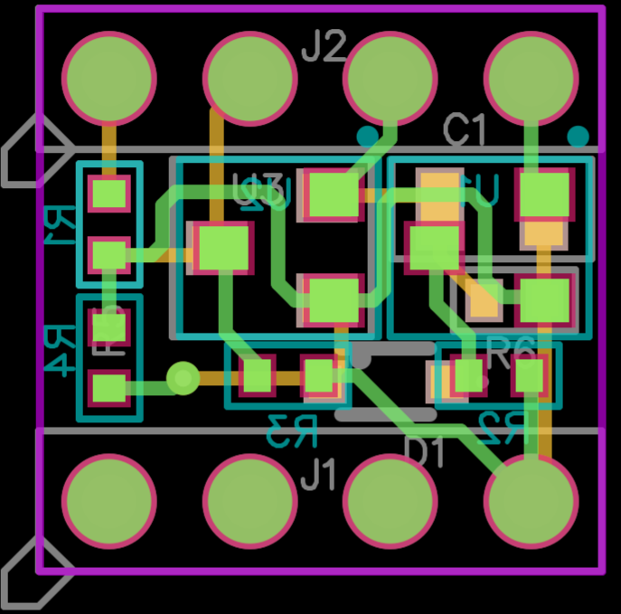

###Diode Compression Opamp Hardware
***
**Top PCB for Dual Discrete Opamp design intended for use in guitar electronics**

***

***

***

***

Files are for Diptrace 2.4. Gerber files can be found in the Manufacturing Files directory. See main directory for licensing. 
